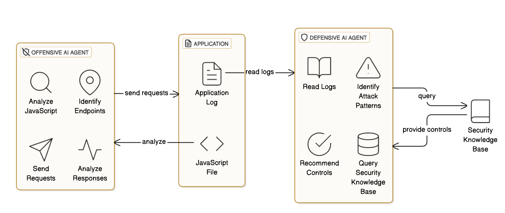
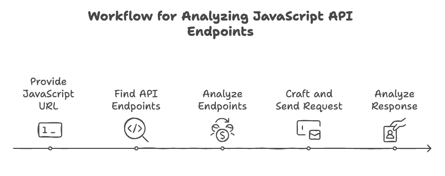
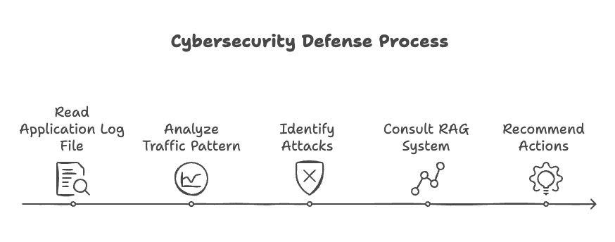

# cyber-safari


## High Level Overview



* There is an application server that has some vulnerabilities.
* There is an offensive agent that tries to exploit the vulnerabilities.
* There is a RAG system that contains the security knowledge base and the security controls required to defend the vulnerabilities.
* There is a defensive agent that tries to propose security controls (derived from the RAG system) to defend against the vulnerabilities.

## Prerequisites

```
virtualenv venv
. venv/bin/activate
pip install -r requirements.txt
```

`export OPENAI_API_KEY=<your-openai-api-key>`

## Code Walkthrough

* `security_docs/` contains the security documents used to create the RAG system.
* `security_tool.py` contains the tool used to query the RAG system. The defense agent uses this tool to query the RAG system for security controls by importing it as`from security_tool import init_security_tool`
* `hack_agent.py` contains the offensive agent code.
* `defense_agent.py` contains the defensive agent code.
* `rag_setup.py` contains the code to setup the RAG system.
* `test_lab.py` contains the code to start the test lab.


## RAG Setup

```
python3 rag_setup.py
```
This will create a directory called `security_kb` with the vector database in your root directory.

## Running the Test Lab

```
python3 test_lab.py
```
This will start the test server locally on port 5000 serving the `main.js` file that has some vulnerabilities. It stores the application logs in the root directory under the directory `app_logs`.

You can verify this by sending some curl requests to the server such as:
```
curl http://localhost:5000/api/v1/profile
curl http://localhost:5000/api/v1/admin
curl http://localhost:5000/api/v1/user-info
```
Notice that they show up in the `app_logs/app.log` file.

## Running the Offensive Agent

```
python3 hack_agent.py
```
This will start the offensive agent that will try to exploit the vulnerabilities in the test server following the below steps:



## Running the Defensive Agent

```
python3 defense_agent.py
```
This will start the defensive agent that reads the application log file from `app_logs/app.log` and tries to recommend security controls based on security best practices available in the RAG system (that is in turn created from the security docs inside the `security_docs` directory). It follows the below steps:


